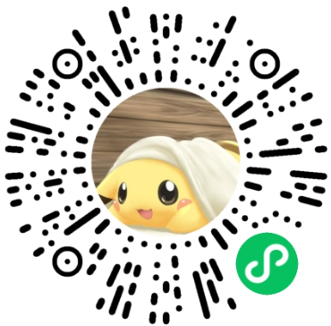

# Heart Island - 数字健康放松应用

Heart Island 是一个专为情绪支持和压力缓解设计的微信小程序应用，提供智能情绪评估和多种放松小游戏。

## 🎯 核心功能

### 情绪评估系统
- 智能情绪测试问卷
- 个性化情绪分析报告
- 基于结果的游戏推荐

### 6款放松小游戏
1. **森林微风** - 呼吸节奏训练
2. **光之治愈** - 冥想放松体验
3. **禅意拼图** - 专注力和耐心训练
4. **记忆卡片** - 认知能力提升
5. **云飘** - 拖拽控制和碰撞检测
6. **泡泡爆破** - 点击交互和粒子效果

### 数据安全与隐私保护
- XOR加密 + Base64编码
- GDPR合规的数据处理
- 隐私设置管理
- 用户数据导出和删除

### 成就与社交系统
- 5种成就类型（游戏、情绪、分享、连续、特殊）
- 排行榜功能
- 多平台社交分享
- 分享奖励系统

## 🛠 技术架构

- **框架**: 微信小程序原生开发
- **设计语言**: 莫兰迪色系，温馨舒适
- **数据存储**: 本地存储 + 云存储
- **加密**: 自定义加密算法
- **UI组件**: 原生微信小程序组件

## 🚀 快速开始

### 开发环境要求
- 微信开发者工具
- 微信小程序账号

### 项目结构
```
app/
├── pages/           # 页面文件
│   ├── welcome/     # 欢迎页面
│   ├── emotion-test/# 情绪测试
│   ├── games/       # 游戏页面
│   ├── privacy-settings/ # 隐私设置
│   ├── social-sharing/   # 社交分享
├── utils/           # 工具类
│   ├── privacy-security.js # 隐私安全
│   └── social-sharing.js # 社交分享
└── app.js/json/wxss # 全局配置
```

## 📱 小程序体验

### 扫码体验


### 体验说明
- 无需注册即可体验核心功能
- 支持所有微信版本
- 首次加载可能需要稍等片刻

## 🔧 核心模块

### 隐私安全模块 (`utils/privacy-security.js`)
- `DataEncryption`: 数据加密解密
- `PrivacyManager`: 隐私设置管理
- `ComplianceChecker`: GDPR合规检查

### 社交分享模块 (`utils/social-sharing.js`)
- `SocialSharingManager`: 分享功能管理
- 多平台分享支持

## 📱 用户界面

### 色彩方案
- 主背景: `#F5F0E6` (温暖米色)
- 导航栏: `#E8D5C4` (柔和粉色)
- 文字: `#78716C` (深灰色)
- 强调色: `#D6C1B8` (莫兰迪粉)

### 页面布局
- 响应式设计
- 流畅的页面转场
- 直观的用户交互

## 🔒 隐私合规

- 符合GDPR数据保护法规
- 透明的数据收集政策
- 用户数据控制权
- 数据加密存储
- 定期合规审查

## 📊 数据分析

- 用户行为跟踪（可选）
- 游戏数据统计
- 情绪变化趋势

## 🎮 游戏特色

每款游戏都经过精心设计：
- **视觉设计**: 舒缓的色彩搭配
- **交互设计**: 简单直观的操作
- **音效设计**: 自然的背景音效
- **进度保存**: 自动保存游戏状态

## 📞 支持与反馈

如有问题或建议，请通过应用内反馈功能联系我们。

---

**Heart Island** - 让心灵找到宁静的港湾 🏝️